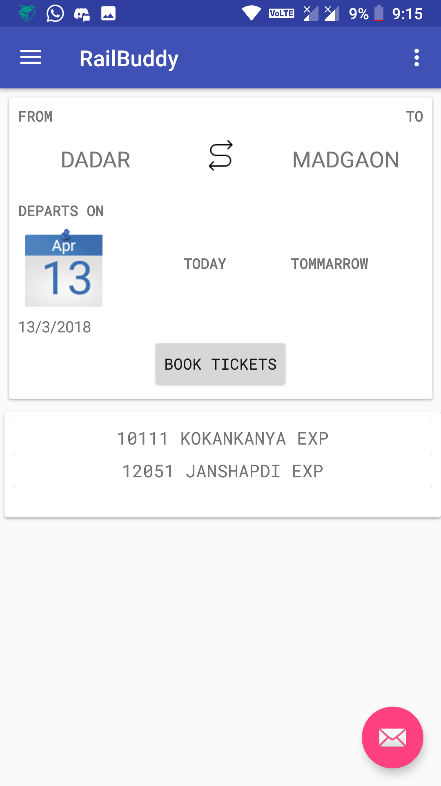
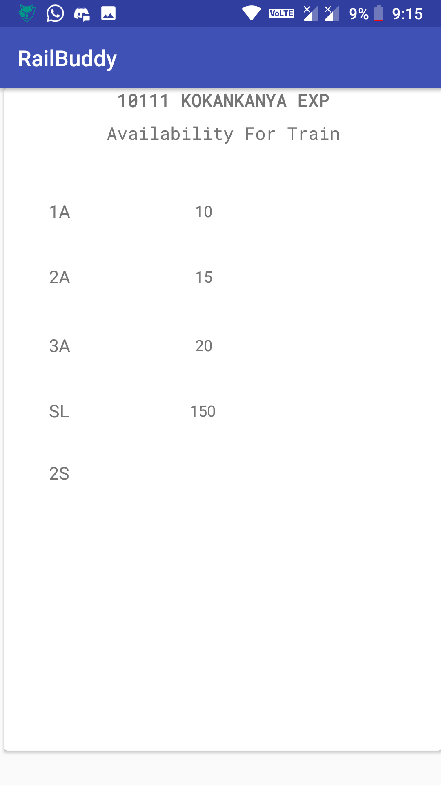
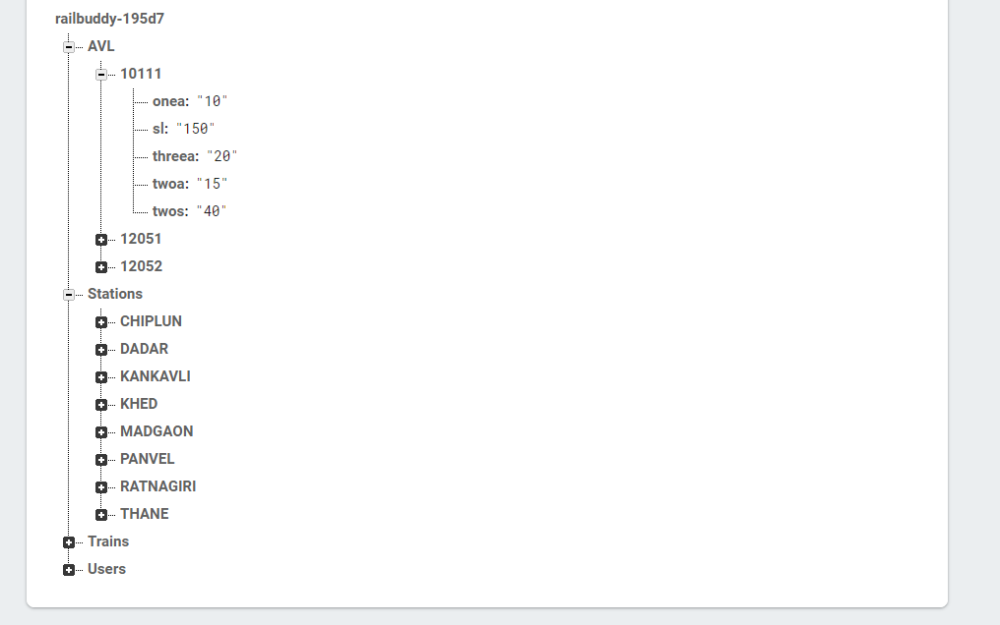

# RailBuddy
Railbuddy - Railway Reservation System Prototype App made For Mini Project in Sem 6
uses Firebase Realtime Daatabase & Auth

Screenshots :-

Home Screen :-

You can Select Routes that are Stored in Firebase Database.
And Accordingly Avalable Trains on that route will be shown 

Availabilty Screen :-

After selecting source and destination it will show trains which has same value and present below. on clicking on avaible train options You can get Values of availability of train.

firebase DB :-

Structure of Firebase Realtime database, simple struture no nested data added for simplicity.

Credits:-
icons8.com for icons 
